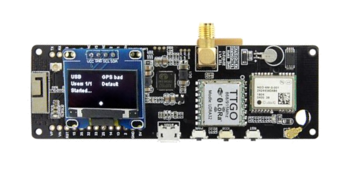
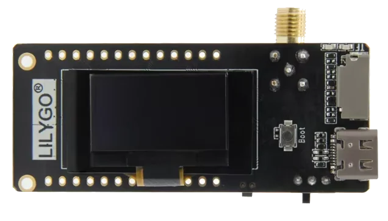
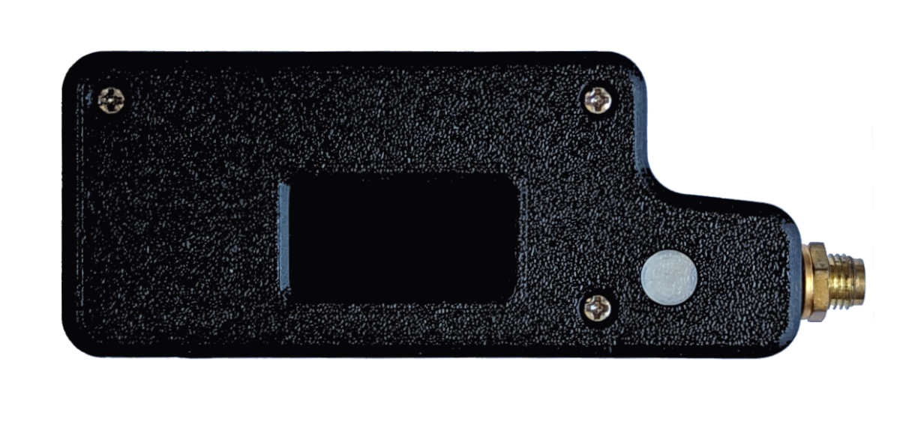
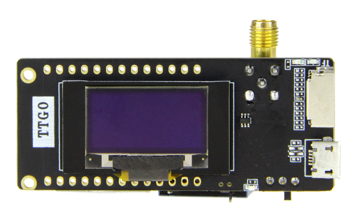
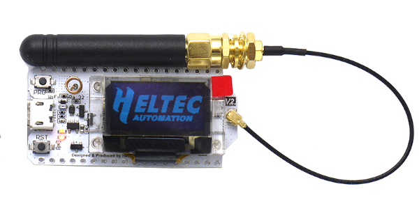

.. _hardware-main:

***********************
Communications Hardware
***********************

One of the truly valuable aspects of Reticulum is the ability to use it over
almost any conceivable kind of communications medium. The :ref:`interface types<interfaces-main>`
available for configuration in Reticulum are flexible enough to cover the use
of most wired and wireless communications hardware available, from decades-old
packet radio modems to modern millimeter-wave backhaul systems.

If you already have or operate some kind of communications hardware, there is a
very good chance that it will work with Reticulum out of the box. In case it does
not, it is possible to provide the necessary glue with very little effort using
for example the :ref:`PipeInterface<interfaces-pipe>` or the :ref:`TCPClientInterface<interfaces-tcpc>`
in combination with code like `TCP KISS Server <https://github.com/simplyequipped/tcpkissserver>`_
by `simplyequipped <https://github.com/simplyequipped>`_.

While this broad support and flexibility is very useful, an abundance of options
can sometimes make it difficult to know where to begin, especially when you are
starting from scratch.

This chapter will outline a few different sensible starting paths to get
real-world functional wireless communications up and running with minimal cost
and effort. Two fundamental devices categories will be covered, *RNodes* and
*WiFi-based radios*. Additionally, other common options will be briefly described.

Knowing how to employ just a few different types of hardware will make it possible
to build a wide range of useful networks with little effort.

Combining Hardware Types
========================

It is useful to combine different link and hardware types when designing and
building a network. One useful design pattern is to employ high-capacity point-to-point
links based on WiFi or millimeter-wave radios (with high-gain directional antennas)
for the network backbone, and using LoRa-based RNodes for covering large areas with
connectivity for client devices.

.. _rnode-main:

RNode
=====

Reliable and general-purpose long-range digital radio transceiver systems are
commonly either very expensive, difficult to set up and operate, hard to source,
power-hungry, or all of the above at the same time. In an attempt to alleviate
this situation, the transceiver system *RNode* was designed. It is important to
note that RNode is not one specific device, from one particular vendor, but
*an open plaform* that anyone can use to build interoperable digital transceivers
suited to their needs and particular situations.

An RNode is a general purpose, interoperable, low-power and long-range, reliable,
open and flexible radio communications device. Depending on its components, it can
operate on many different frequency bands, and use many different modulation
schemes, but most commonly, and for the purposes of this chapter, we will limit
the discussion to RNodes using *LoRa* modulation in common ISM bands.

**Avoid Confusion!** RNodes can use LoRa as a *physical-layer modulation*, but it
does not use, and has nothing to do with the *LoRaWAN* protocol and standard, commonly
used for centrally controlled IoT devices. RNodes use *raw LoRa modulation*, without
any additional protocol overhead. All high-level protocol functionality is handled
directly by Reticulum.

.. _rnode-creating:

Creating RNodes
^^^^^^^^^^^^^^^
RNode has been designed as a system that is easy to replicate across time and
space. You can put together a functioning transceiver using commonly available
components, and a few open source software tools. While you can design and build RNodes
completely from scratch, to your exact desired specifications, this chapter
will explain the easiest possible approach to creating RNodes: Using common
LoRa development boards. This approach can be boiled down to two simple steps:

1. Obtain one or more supported development boards
2. Install the RNode firmware with the automated installer

Once the firmware has been installed and provisioned by the install script, it
is ready to use with any software that supports RNodes, including Reticulum.
The device can be used with Reticulum by adding an :ref:`RNodeInterface<interfaces-rnode>`
to the configuration.

.. _rnode-supported:

Supported Boards
^^^^^^^^^^^^^^^^
To create one or more RNodes, you will need to obtain supported development
boards. The following boards are supported by the auto-installer.

------------

.. image:: graphics/board_tbeam_supreme.png
    :width: 75%
    :align: center

LilyGO T-Beam Supreme
"""""""""""""
- **Transceiver IC** Semtech SX1262, SX1268
- **Device Platform** ESP32
- **Manufacturer** `LilyGO <https://lilygo.cn>`_

------------

LilyGO T-Beam
"""""""""""""
- **Transceiver IC** Semtech SX1262, SX1268, SX1276 and SX1278
- **Device Platform** ESP32
- **Manufacturer** `LilyGO <https://lilygo.cn>`_

------------

LilyGO T3S3
"""""""""""
- **Transceiver IC** Semtech SX1262, SX1268, SX1276 and SX1278
- **Device Platform** ESP32
- **Manufacturer** `LilyGO <https://lilygo.cn>`_

------------

.. image:: graphics/board_rak4631.png
    :width: 45%
    :align: center

RAK4631-based Boards
""""""""""""""""""""
- **Transceiver IC** Semtech SX1262, SX1268
- **Device Platform** nRF52
- **Manufacturer** `RAK Wireless <https://www.rakwireless.com>`_

------------

Unsigned RNode v2.x
"""""""""""""""""""
- **Transceiver IC** Semtech SX1276 and SX1278
- **Device Platform** ESP32
- **Manufacturer** `unsigned.io <https://unsigned.io>`_

------------

LilyGO LoRa32 v2.1
""""""""""""""""""
- **Transceiver IC** Semtech SX1276 and SX1278
- **Device Platform** ESP32
- **Manufacturer** `LilyGO <https://lilygo.cn>`_

------------

.. image:: graphics/board_t3v20.png
    :width: 46%
    :align: center

LilyGO LoRa32 v2.0
""""""""""""""""""
- **Transceiver IC** Semtech SX1276 and SX1278
- **Device Platform** ESP32
- **Manufacturer** `LilyGO <https://lilygo.cn>`_

------------

.. image:: graphics/board_t3v10.png
    :width: 46%
    :align: center

LilyGO LoRa32 v1.0
""""""""""""""""""
- **Transceiver IC** Semtech SX1276 and SX1278
- **Device Platform** ESP32
- **Manufacturer** `LilyGO <https://lilygo.cn>`_

------------

.. image:: graphics/board_tdeck.png
    :width: 45%
    :align: center

LilyGO T-Deck
"""""""""""""
- **Transceiver IC** Semtech SX1262, SX1268
- **Device Platform** ESP32
- **Manufacturer** `LilyGO <https://lilygo.cn>`_

------------

.. image:: graphics/board_heltec32v30.png
    :width: 58%
    :align: center

Heltec LoRa32 v3.0
""""""""""""""""""
- **Transceiver IC** Semtech SX1262 and SX1268
- **Device Platform** ESP32
- **Manufacturer** `Heltec Automation <https://heltec.org>`_

------------

Heltec LoRa32 v2.0
""""""""""""""""""
- **Transceiver IC** Semtech SX1276 and SX1278
- **Device Platform** ESP32
- **Manufacturer** `Heltec Automation <https://heltec.org>`_

------------

.. image:: graphics/board_rnode.png
    :width: 50%
    :align: center

Unsigned RNode v1.x
"""""""""""""""""""
- **Transceiver IC** Semtech SX1276 and SX1278
- **Device Platform** AVR ATmega1284p
- **Manufacturer** `unsigned.io <https://unsigned.io>`_

------------

.. _rnode-installation:

Installation
^^^^^^^^^^^^

Once you have obtained compatible boards, you can install the `RNode Firmware <https://github.com/markqvist/RNode_Firmware>`_
using the `RNode Configuration Utility <https://github.com/markqvist/rnodeconfigutil>`_.
If you have installed Reticulum on your system, the ``rnodeconf`` program will already be
available. If not, make sure that ``Python3`` and ``pip`` is installed on your system, and
then install Reticulum with with ``pip``:

.. code::

   pip install rns

Once installation has completed, it is time to start installing the firmware on your
devices. Run ``rnodeconf`` in auto-install mode like so:

.. code::

   rnodeconf --autoinstall

The utility will guide you through the installation process by asking a series of
questions about your hardware. Simply follow the guide, and the utility will
auto-install and configure your devices.

.. _rnode-usage:

Usage with Reticulum
^^^^^^^^^^^^^^^^^^^^
When the devices have been installed and provisioned, you can use them with Reticulum
by adding the :ref:`relevant interface section<interfaces-rnode>` to the configuration
file of Reticulum. In the configuraion you can specify all interface parameters,
such as serial port and on-air parameters.

WiFi-based Hardware
===================

It is possible to use all kinds of both short- and long-range WiFi-based hardware
with Reticulum. Any kind of hardware that fully supports bridged Ethernet over the
WiFi interface will work with the :ref:`AutoInterface<interfaces-auto>` in Reticulum.
Most devices will behave like this by default, or allow it via configuration options.

This means that you can simply configure the physical links of the WiFi based devices,
and start communicating over them using Reticulum. It is not necessary to enable any IP
infrastructure such as DHCP servers, DNS or similar, as long as at least Ethernet is
available, and packets are passed transparently over the physical WiFi-based devices.

.. only:: html

    .. image:: graphics/radio_rblhg5.png
        :width: 49%

    .. image:: graphics/radio_is5ac.png
        :width: 49%

Below is a list of example WiFi (and similar) radios that work well for high capacity
Reticulum links over long distances:

- `Ubiquiti airMAX radios <https://store.ui.com/collections/operator-airmax-devices>`_
- `Ubiquiti LTU radios <https://store.ui.com/collections/operator-ltu>`_
- `MikroTik radios <https://mikrotik.com/products/group/wireless-systems>`_

This list is by no means exhaustive, and only serves as a few examples of radio hardware
that is relatively cheap while providing long range and high capacity for Reticulum
networks. As in all other cases, it is also possible for Reticulum to co-exist with IP
networks running concurrently on such devices.

Ethernet-based Hardware
=======================

Reticulum can run over any kind of hardware that can provide a switched Ethernet-based
medium. This means that anything from a plain Ethernet switch, to fiber-optic systems,
to data radios with Ethernet interfaces can be used by Reticulum.

The Ethernet medium does not need to have any IP infrastructure such as DHCP servers
or routing set up, but in case such infrastructure does exist, Reticulum will simply
co-exist with.

To use Reticulum over Ethernet-based mediums, it is generally enough to use the included
:ref:`AutoInterface<interfaces-auto>`. This interface also works over any kind of
virtual networking adapter, such as ``tun`` and ``tap`` devices in Linux.

Serial Lines & Devices
======================

Using Reticulum over any kind of raw serial line is also possible with the
:ref:`SerialInterface<interfaces-serial>`. This interface type is also useful for
using Reticulum over communications hardware that provides a serial port interface.

Packet Radio Modems
===================

Any packet radio modem that provides a standard KISS interface over USB, serial or TCP
can be used with Reticulum. This includes virtual software modems such as
`FreeDV TNC <https://github.com/xssfox/freedv-tnc>`_ and `Dire Wolf <https://github.com/wb2osz/direwolf>`_.
